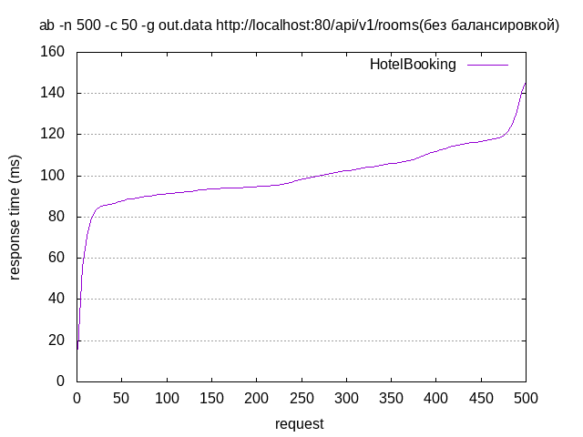
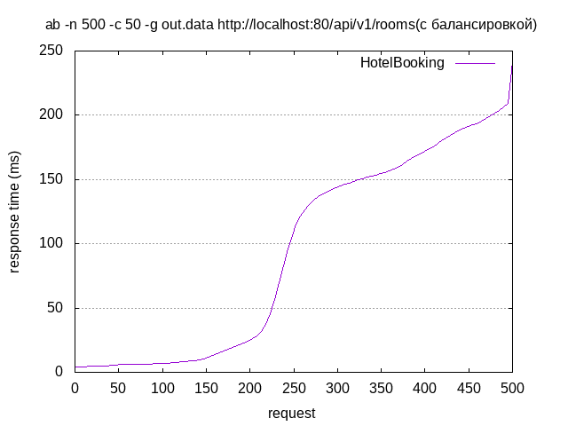
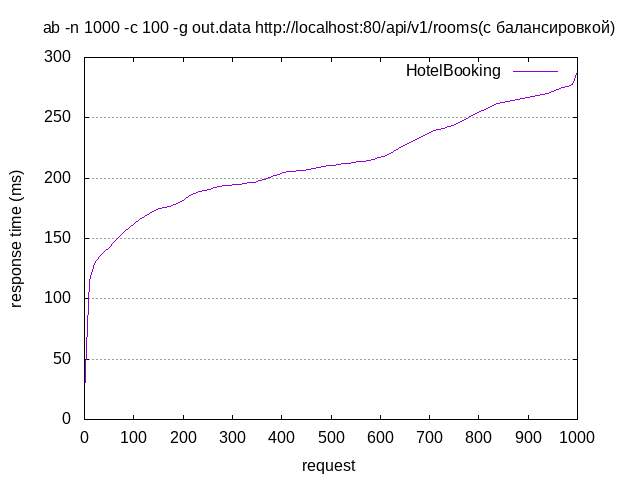
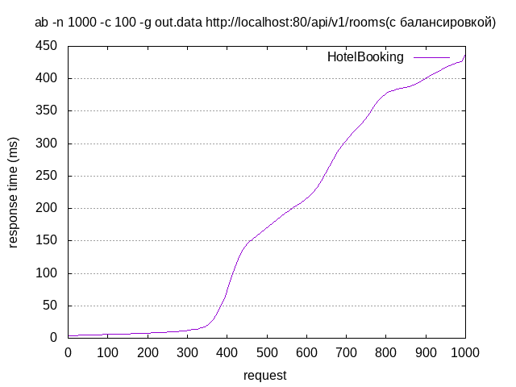

# Нагрузочное тестирование
Command for create image: 
```shell
gnuplot out.data
```
Для проведения нагрузочного тестирования веб-веб сервера использовался Apache Benchmark.

Было проведено три теста с разным общим количеством запросов и с разным количеством параллельных запросов.

## Тест 1

#### Команда
```shell
ab -n 500 -c 50 -g out.data http://localhost:80/api/v1/rooms
```

### Результаты без балансировки

```
Server Software:        HotelBooking
Server Hostname:        localhost
Server Port:            80

Document Path:          /api/v1/rooms
Document Length:        260 bytes

Concurrency Level:      100
Time taken for tests:   2.202 seconds
Complete requests:      1000
Failed requests:        0
Total transferred:      491000 bytes
HTML transferred:       260000 bytes
Requests per second:    454.11 [#/sec] (mean)
Time per request:       220.213 [ms] (mean)
Time per request:       2.202 [ms] (mean, across all concurrent requests)
Transfer rate:          217.74 [Kbytes/sec] received

Connection Times (ms)
              min  mean[+/-sd] median   max
Connect:        0    0   0.9      0       4
Processing:    20  212  40.1    210     286
Waiting:       16  212  40.1    210     286
Total:         21  213  39.9    211     288
```



### Результаты с балансировкой

```
Server Software:        HotelBooking
Server Hostname:        localhost
Server Port:            80

Document Path:          /api/v1/rooms
Document Length:        260 bytes

Concurrency Level:      50
Time taken for tests:   1.000 seconds
Complete requests:      500
Failed requests:        0
Total transferred:      245500 bytes
HTML transferred:       130000 bytes
Requests per second:    500.08 [#/sec] (mean)
Time per request:       99.983 [ms] (mean)
Time per request:       2.000 [ms] (mean, across all concurrent requests)
Transfer rate:          239.79 [Kbytes/sec] received

Connection Times (ms)
              min  mean[+/-sd] median   max
Connect:        0    0   0.5      0       2
Processing:     4   92  77.5    113     241
Waiting:        4   92  77.6    113     241
Total:          4   92  77.6    113     242
```


## Тест 2

#### Команда
```shell
ab -n 1000 -c 100 -g out.data http://localhost:80/api/v1/rooms
```

### Результаты без балансировки

```
Server Software:        HotelBooking
Server Hostname:        localhost
Server Port:            80

Document Path:          /api/v1/rooms
Document Length:        1048 bytes

Concurrency Level:      100
Time taken for tests:   8.178 seconds
Complete requests:      1000
Failed requests:        0
Total transferred:      1280000 bytes
HTML transferred:       1048000 bytes
Requests per second:    122.28 [#/sec] (mean)
Time per request:       817.812 [ms] (mean)
Time per request:       8.178 [ms] (mean, across all concurrent requests)
Transfer rate:          152.85 [Kbytes/sec] received

Connection Times (ms)
              min  mean[+/-sd] median   max
Connect:        0    1   3.6      0      16
Processing:   110  782 159.7    781    1436
Waiting:      110  782 159.9    781    1436
Total:        125  784 160.9    783    1439
```

### Результаты с балансировкой

```
Server Software:        HotelBooking
Server Hostname:        localhost
Server Port:            80

Document Path:          /api/v1/rooms
Document Length:        260 bytes

Concurrency Level:      100
Time taken for tests:   1.891 seconds
Complete requests:      1000
Failed requests:        0
Total transferred:      491000 bytes
HTML transferred:       260000 bytes
Requests per second:    528.76 [#/sec] (mean)
Time per request:       189.120 [ms] (mean)
Time per request:       1.891 [ms] (mean, across all concurrent requests)
Transfer rate:          253.54 [Kbytes/sec] received

Connection Times (ms)
              min  mean[+/-sd] median   max
Connect:        0    0   0.9      0       4
Processing:     4  178 158.2    172     438
Waiting:        4  178 158.2    172     438
Total:          4  179 158.2    174     438
```
